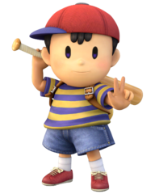

# <a href="https://www.youtube.com/watch?v=pFItwUVOd5c">P+ Knowledge Database</a>

## Universal Information
<a href="Universal/Universal.md"> 

## Characters
<table>
    <tr>
        <td> <a href="Characters/Bowser.md"> </td>
        <td> <a href="Characters/Captain Falcon.md"> </td>
        <td> <a href="Characters/Charizard.md"> </td>
        <td> <a href="Characters/Dedede.md"> </td>
    </tr>
    <tr>
        <td> <a href="Characters/Diddy Kong.md"> </td>
        <td> <a href="Characters/Donkey Kong.md"> </td>
        <td> <a href="Characters/Falco.md"> </td>
        <td> <a href="Characters/Fox.md"> </td>
    </tr>
     <tr>
        <td> <a href="Characters/Ganondorf.md"> </td>
        <td> <a href="Characters/Ice Climbers.md"> </td>
        <td> <a href="Characters/Ike.md"> </td>
        <td> <a href="Characters/Ivysaur.md"> </td>
    </tr>
     <tr>
        <td> <a href="Characters/Jigglypuff.md"> </td>
        <td> <a href="Characters/Kirby.md"> </td>
        <td> <a href="Characters/Knuckles.md"> </td>
        <td> <a href="Characters/Link.md"> </td>
    </tr>
     <tr>
        <td> <a href="Characters/Lucario.md"> </td>
        <td> <a href="Characters/Lucas.md"> </td>
        <td> <a href="Characters/Luigi.md"> </td>
        <td> <a href="Characters/Mario.md"> </td>
    </tr>
     <tr>
        <td> <a href="Characters/Marth.md"> </td>
        <td> <a href="Characters/Meta Knight.md"> </td>
        <td> <a href="Characters/Mewtwo.md"> </td>
        <td> <a href="Characters/Mr. Game and Watch.md"> </td>
    </tr>
     <tr>
        <td> <a href="Characters/Ness.md"> </td>
        <td> <a href="Characters/Olimar.md"> </td>
        <td> <a href="Characters/Peach.md"> </td>
        <td> <a href="Characters/Pikachu.md"> </td>
    </tr>
     <tr>
        <td> <a href="Characters/Pit.md"> </td>
        <td> <a href="Characters/ROB.md"> </td>
        <td> <a href="Characters/Roy.md"> </td>
        <td> <a href="Characters/Samus.md"> </td>
    </tr>
     <tr>
        <td> <a href="Characters/Sheik.md"> </td>
        <td> <a href="Characters/Snake.md"> </td>
        <td> <a href="Characters/Sonic.md"> </td>
        <td> <a href="Characters/Squirtle.md"> </td>
    </tr>
    <tr>
        <td> <a href="Characters/Toon Link.md"> </td>
        <td> <a href="Characters/Wario.md"> </td>
        <td> <a href="Characters/Wolf.md"> </td>
        <td> <a href="Characters/Yoshi.md"> </td>
    </tr>
    <tr>
        <td> <a href="Characters/Zelda.md"> </td>
        <td> <a href="Characters/Zero Suit Samus.md"> </td>
    </tr>
</table>

## Legacy information
<a href="Universal/Project M Legacy.md"> 

